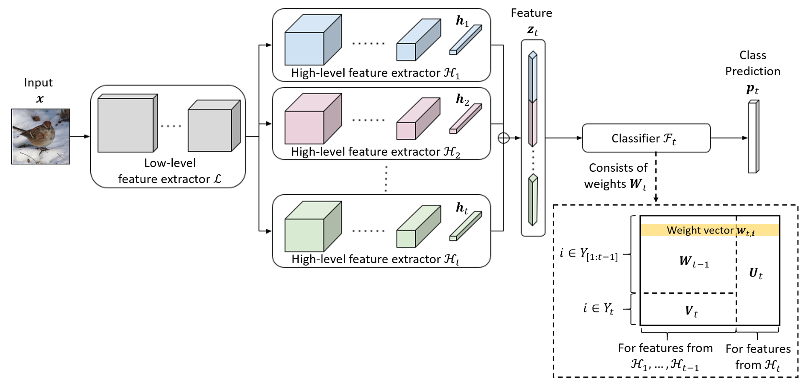

# Leveraging the Old to Learn the New in Continual Learning

This repository is the official implementation of Leveraging the Old to Learn the New in Continual Learning. 




## Requirements

To install requirements:

```setup
pip install -r requirements.txt
```

To prepare datasets, please refer to the respective folders for instructions:
- CUB200: [data/cub200](data/cub200)
- EyePACS: [data/diabetic](data/diabetic)
- HAM10000: [data/ham10000](data/ham10000)

## Training

To run experiments on CUB200 with three different class orders and the protocol of 10 classes per step using our proposed method:

```bash
python3 -minclearn --options options/der/derE3_cub200.yaml options/data/cub200_3orders.yaml \
    --initial-increment 100 --increment 10 --fixed-memory --workers 4 --batch-size 32 \
    --device <gpu_id> --label derE3_cub200_100steps10 \
    --data-path data/cub200
```

Likewise, for EyePACS with three different class orders and the protocol of 1 class per step:

```bash
python3 -minclearn --options options/der/derE3_diabetic.yaml options/data/diabetic_3orders.yaml \
    --initial-increment 3 --increment 1 --fixed-memory --workers 4 --batch-size 128 \
    --device <gpu_id> --label derE3_diabetic_3steps1 \
    --data-path data/diabetic
```

And, for HAM10000:

```bash
python3 -minclearn --options options/der/derE3_ham10000.yaml options/data/ham10000_3orders.yaml \
    --initial-increment 3 --increment 1 --fixed-memory --workers 4 --batch-size 32 \
    --device <gpu_id> --label derE0_ham10000_3steps1 \
    --data-path data/ham10000
```


To conduct experiments using the baseline methods, you just need to replace the first argument of `--options` with the path to the corresponding hyperparemeter file, which can be found under the folder [options](options).

By default, no checkpoints will be saved. To save them after training of each task, add the argument `--save-model task`.


## Results

Your training and evaluation results would be found under the folder [results/dev](results), including the summary of the tasks in each run.

For reproduction of the results without training from scratch, we included the outputs from our training under the folder [results/pretrain](results/pretrain). To generate the images and results found in the paper, follow the steps under the notebook `metric.ipynb` and `gradcam.ipynb`. 

Below shows a summary of our model performance:

| Dataset          | New classes per step | Average incremental accuracy |
| :--------------- | :------------------: | :--------------------------: |
| CUB200           |          5           |            81.9              |
| CUB200           |         10           |            82.8              |
| EyePACS          |          1           |            81.9              |
| HAM10000         |          1           |            78.1              |
| HAM10000         |          2           |            82.0              |


## Acknowledgement

Thanks for the great code base by [Arthur Douillard](https://github.com/arthurdouillard/incremental_learning.pytorch) and [Shipeng Yan](https://github.com/Rhyssiyan/DER-ClassIL.pytorch).

